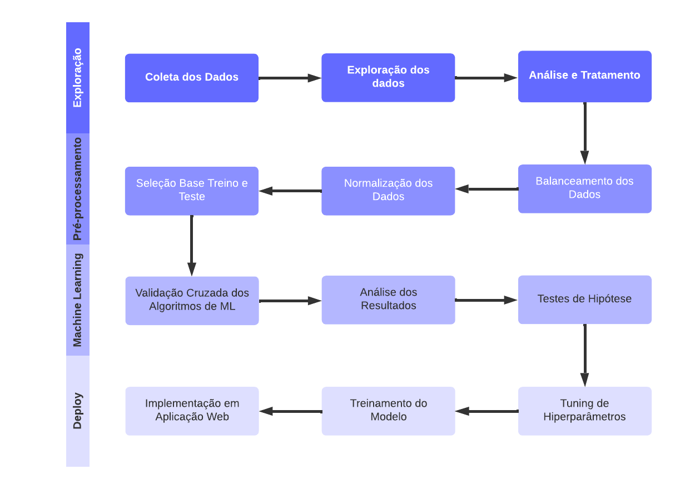

# Previsão de Churn para Clientes Bancários

## Objetivo do Projeto:
O objetivo do projeto é desenvolver um sistema de previsão de churn para clientes de um banco, aplicando técnicas de machine learning e análise preditiva.

## Sobre o Dataset:
O dataset utilizado neste projeto foi o [Churn for Bank Customers](https://www.kaggle.com/datasets/mathchi/churn-for-bank-customers), que esta disponível na plataforma [Kaggle.com](https://www.kaggle.com/).

<b>Dicionário dos dados:</b>

||Colunas|Descrição|
|---|---|---|
|1|RowNumber|Corresponde ao número do registo.|
|2|CustomerId|Código do Cliente do banco.|
|3|Surname|Sobrenome de um cliente.|
|4|CreditScore|Pontuação de Crédito.|
|5|Geography|Localização dos clientes.|
|6|Gender|Gênero dos clientes.|
|7|Age|Idade dos Clientes.|
|8|Tenure|Refere-se ao número de anos em que o cliente é cliente do banco.|
|9|Balance|Saldo bancário dos clientes.|
|10|NumOfProducts|Quantidade de produtos contratadas pelos clientes.|
|11|HasCrCard|Indica se um cliente tem ou não um cartão de crédito.|
|12|IsActiveMember|Os clientes são ativos ou não.|
|13|EstimatedSalary|Estimativa de salário dos clientes.|
|14|Exited|Objetivo. 1 se o cliente saiu ou 0 se não o fez.|

## Arquivos do Projeto:
- [jupyter Notebook (Análises e Criação do Modelo Preditivo)](./Previsao_Churn_Clientes_Bancarios.ipynb)
- [Código Fonte da Aplicação](./app.py)
- [Modelo de ML Criado](./modelo/modelo_previsao_churn.sav)
- [Bases de Dados](./dados/)
- [Imagens](./img/)
- [License](./LICENSE)

## Contextualização:
Diante da crescente competitividade no setor bancário, a retenção de clientes emerge como uma prioridade estratégica essencial para assegurar a sustentabilidade e expansão das instituições. O fenômeno conhecido como "churn", caracterizado pela perda de clientes para concorrentes ou pelo encerramento voluntário da relação bancária, apresenta-se como um desafio significativo e preocupante. Como medida para solucionar essa questão, as instituições estão recorrendo às suas equipes de dados para desenvolver projetos que permitam a previsão do churn.

Nesse contexto, uma instituição específica procurou a sua equipe de dados para analisar e criar uma solução que capacitasse a equipe de negócios a antecipar a saída dos clientes, visando reduzir a taxa de churn e aumentar a taxa de retenção.

## Proposta de Solução:
A equipe de dados propôs uma solução que consiste no desenvolvimento de um modelo de classificação integrado a um dashboard de monitoramento. Essa abordagem conferirá à empresa a habilidade de analisar e antecipar a possível perda de clientes, capacitando-a a implementar ações proativas para manter esses clientes vinculados à instituição.

## Aplicação Web:

>Clique na Imagem Abaixo para Abrir a Análise de Churn.

## Desenvolvimento do Projeto:

### Workflow:

### Checklist:
- [X] Exploração e Análise dos Dados.
- [X] Balanceamento e Pré-processamento de Dados.
- [X] Modelagem Preditiva.
- [X] Validação do Modelo.
- [X] Implementação em Produção.

### Ferramentas Utilizadas:
Na implementação deste projeto usamos as ferramentas relacionadas abaixo:
- [Python 3.11.5](https://docs.python.org/pt-br/3.11/)
    - [Pandas](https://pandas.pydata.org/docs/)
    - [Numpy](https://numpy.org/doc/)
    - [Matplotlib](https://matplotlib.org/stable/index.html)
    - [Seaborn](https://seaborn.pydata.org/)
	- [Plotly](https://plotly.com/python/)
    - [Pickle](https://docs.python.org/pt-br/3/library/pickle.html)
    - [Scikit learn](https://scikit-learn.org/stable/user_guide.html)
	- [Scipy](https://scipy.org/)
    - [Streamlit](https://docs.streamlit.io/)
    - [Warnings](https://docs.python.org/pt-br/3/library/warnings.html)
- [Jupyter Notebook](https://docs.jupyter.org/en/latest/)
- [Visual Studio Code](https://code.visualstudio.com/docs)

### Implementação do Modelo na Aplicação:
O deploy da aplicação foi realizado na [Streamlit Community Cloud](https://docs.streamlit.io/streamlit-community-cloud), que é uma plataforma aberta e gratuita para a comunidade implementar, descobrir e partilhar aplicações e código Streamlit entre si.

O aplicativo desenvolvido constitui uma solução web criada para facilitar a identificação de clientes propensos a churn, utilizando técnicas de machine learning. Visando proporcionar uma análise ágil e precisa, busca automatizar esse processo, agilizando a tomada de decisões para intervenções mais rápidas junto aos clientes em risco de deixar a empresa.

### Benefícios da Aplicação:

- **Eficiência**: Implementação de análise automatizada.
- **Precisão**: Tomada de decisões embasada em dados por meio de análise preditiva, utilizando filtros aplicados.
- **Acessibilidade**: Disponibilidade contínua da aplicação a qualquer momento e em qualquer local com acesso à internet.

## Conclusão
Em conclusão, o projeto de "Análise de Churn" revelou-se um sucesso ao empregar o algoritmo Random Forest, o qual demonstrou uma notável precisão de 94%. Diante de uma taxa de churn inicial de 20%, a aplicação eficaz desse modelo oferece insights valiosos e a capacidade de identificar padrões complexos nos dados. O projeto proporcionou uma ferramenta confiável para antecipar e mitigar a perda de clientes. A alta precisão alcançada valida a escolha do algoritmo, destacando a sua eficácia na identificação de potenciais casos de churn. Este êxito não apenas fortalece a compreensão da dinâmica dos clientes, mas também oferece uma base sólida para estratégias proativas de retenção, contribuindo assim para a sustentabilidade e crescimento do negócio.